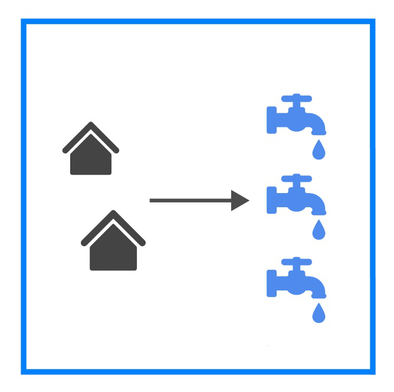
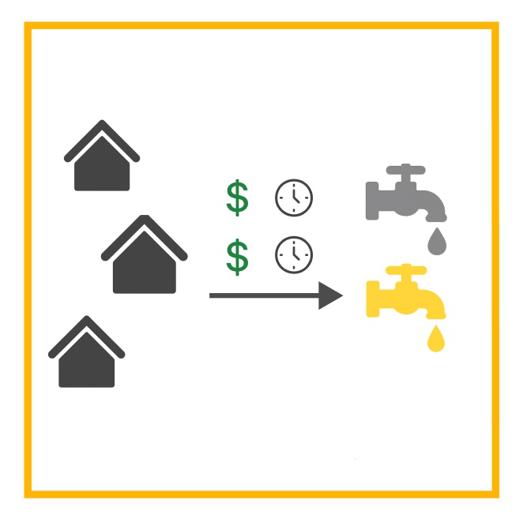
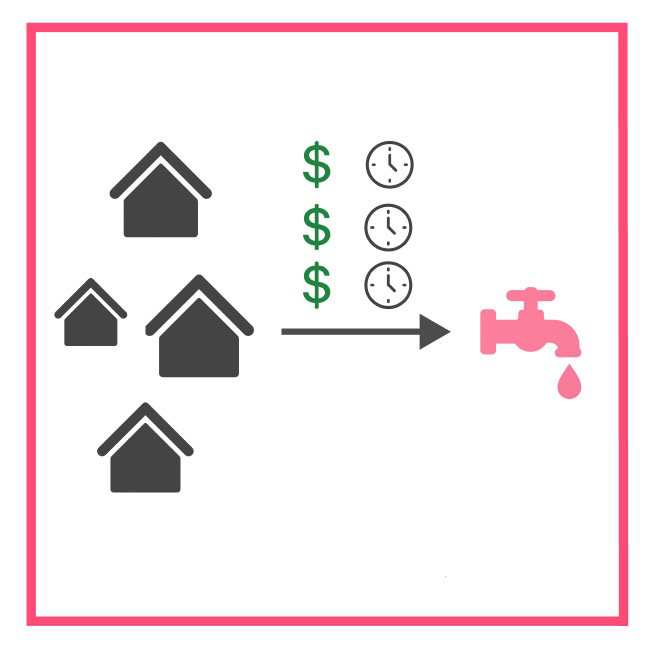

# 🚰 Drinking Water Access Deprivation

Drinking Water Access Deprivation is a dataset that depicts how difficult it is for households in deprived urban areas to **access safe and reliable drinking water**. Access to improved water is a basic human right and a critical determinant of health and wellbeing, yet more than 2 billion people worldwide lack access to safely managed drinking water at home, with Sub-Saharan Africa bearing a disproportionate burden of this crisis [(UNICEF, 2024)](https://data.unicef.org/topic/water-and-sanitation/drinking-water/). For vulnerable households in informal settlements, unreliable access to water increases time burdens, health risks, and gender inequalities, as women and children often bear the responsibility for water collection.

💡 This page will help you understand more about how the classifications of Low – Medium – High are assessed in our data model.

---

## Definitions of Deprivation Levels

This dataset combines the **supply of waterpoints** (e.g., improved, unimproved, functional, or non-functional, drinkable, non-drinkable), the **demand** from household population data (WorldPop), and the **physical accessibility** represented in travel time (e.g., walking time, queuing, competition at waterpoints). Using the **Enhanced Two-Step Floating Catchment Area (E2SFCA)** method [(Luo & Qi, 2009)](https://www.sciencedirect.com/science/article/abs/pii/S1353829209000574), these factors are used to estimate **access deprivation**, defined as the inverse of accessibility and categorized as **Low, Medium, or High** [(Kiani et al., 2021)](https://archpublichealth.biomedcentral.com/articles/10.1186/s13690-021-00601-8); [(Vadrevu & Kanjilal, 2016)](https://equityhealthj.biomedcentral.com/articles/10.1186/s12939-016-0376-y).

Below, we give the adopted definitions of Drinking Water Access Deprivation:

### Low

> My neighbourhood has good access to improved waterpoints within short walking distance. Water is reliable, safe, and affordable, and competition for facilities is low.

---

### Medium

> My neighbourhood has access to some waterpoints, but I face trade-offs: either long walking times, inconsistent service, or queuing at crowded points. Water is sometimes affordable and safe but not always guaranteed.

---

### High

> It is difficult to find adequate drinking water in my neighbourhood. I walk long distances (often more than 30 minutes) or rely on unsafe/unreliable sources. Competition for improved waterpoints is high, and affordability is a barrier.

---

To learn more about how you can help improve the accuracy of these classifications, visit our page on [How to Validate Our Data](/docs/using-the-map/how-to-validate-our-data).

## Additional Insights into Modelling Drinking Water Access Deprivation

The dataset was developed as part of the IDEAMAPS project, using the E2SFCA method to combine the distribution of waterpoints, travel times, and population demand. Waterpoint Offer considered the quality and reliability of drinking waterpoints. The dataset was obtained from Donate Water Nigeria, comprising 684 waterpoints collected in 2023. After a multi-step cleaning and validation process (removing spatial outliers, records with incomplete information, and waterpoints falling outside the defined study areas), the dataset was reduced to 423 waterpoints restricted to the central urban area of Kano. Waterpoints were classified by functionality, source type (improved vs. unimproved), and drinkability, using established international standards. While this dataset provides rich community-sourced infrastructure data, its coverage is limited and it is not yet publicly accessible, pending data-sharing agreements.

Population Demand relied on the [(WorldPop 2020 population dataset)](https://hub.worldpop.org/geodata/summary?id=28031) at 100 m resolution. Population values were assigned to each grid cell by spatial overlay, with population grid centroids serving as origin points for accessibility calculations. This ensured that accessibility metrics were population-weighted and accurately reflected settlement patterns within the study area. While WorldPop offers high-resolution, UN-adjusted estimates that are widely validated and comparable across contexts, limitations remain: it may not fully capture recent urban growth, particularly in informal settlements, and it provides de facto rather than de jure populations, without demographic disaggregation (e.g., age, gender).

The Waterpoint Offer and Population Demand were integrated using the Enhanced Two-Step Floating Catchment Area (E2SFCA) method, which accounted for travel time, service quality, and competition between population demand and available waterpoints. A one-hour travel-time cutoff was applied, and the resulting accessibility scores were grouped into three categories—Low, Medium, and High deprivation guided by statistical distribution, [(UNICEF, 2024)](https://data.unicef.org/topic/water-and-sanitation/drinking-water/) standards, African urban case studies, and feedback from local stakeholders.

---

## Limitations and Assumptions

- Population data (WorldPop 2020) provides high-resolution, UN-adjusted estimates based on census counts. However, it may not fully capture recent urban growth, particularly in informal settlements, and it does not provide demographic disaggregation (e.g., age, gender).
- Waterpoint dataset (Donate Water Nigeria) has limited spatial coverage, restricted to the central urban area of Kano, and is not yet publicly accessible pending data-sharing agreements.
- Not all informal water vendors or small-scale distribution points were captured in the dataset.
- Service reliability was approximated where direct monitoring data were missing.
- Travel time estimates rely on routing assumptions and may not always capture seasonal variability (e.g., flooding).
- Local validation was limited, as only one community in Kano was able to validate the result, and the cutoff applied captured just one of the two communities.
- The waterpoint dataset was cleaned to remove outliers, incomplete records, and points outside the study area, which may have reduced representativeness at the edges of the dataset.

---

## Focus Area for Validation

The focus areas is where one vulnerable community collaborated with IDEAMAPS to validate the model in Kano, Nigeria: Dorayi Karama.

---

## Data Used for Modelling

The model relies on the following datasets:
-   [Waterpoint data](https://donatewater.ng/about/) which is not yet publicly accessible, pending data-sharing agreements.
-   [Population counts from WorldPop](https://hub.worldpop.org/geodata/summary?id=28031)
-   [Road network data from OpenStreetMap via the Open Route Service API](https://openrouteservice.org/)
- **Participatory validation with local communities**

---

## Appendix: Enhanced Two-Step Floating Catchment Area (E2SFCA) Method

The E2SFCA method improves upon the traditional 2SFCA by incorporating a distance decay function while accounting for competition between supply and demand. This makes it particularly well-suited for analyzing water accessibility in dense urban environments, where both facility crowding and travel time strongly influence access patterns [(Luo & Qi, 2009)](https://doi.org/10.1016/j.healthplace.2009.06.002)). It is calculated in two steps:

**Step 1: Calculate the supply-to-demand ratio $R_i$ for each supply location $i$:**

$$
R_i = \frac{S_i}{\sum_{k \in \{d_{ik} \leq d_0\}} W(d_{ik}) P_k}
$$

**Step 2: Calculate the accessibility $A_j$ for each demand location $j$:**

$$
A_j = \sum_{i \in \{d_{ij} \leq d_0\}} W(d_{ij}) R_i
$$

Where:  
- $A_j$: Accessibility score for demand location $j$.  
- $R_i$: Supply-to-demand ratio at supply location $i$.  
- $S_i$: Supply (e.g., capacity of waterpoints facilities) at location $i$.  
- $P_k$: Population demand at location $k$.  
- $d_{ij}$: Distance between supply location $i$ and demand location $j$.  
- $d_0$: Threshold distance within which accessibility is considered.  
- $W(d)$: Distance decay weight function (e.g., Gaussian, exponential, or stepwise).  
- $\sum_{k \in \{d_{ik} \leq d_0\}}$: Summation over all demand locations $k$ within the threshold distance $d_0$ from supply location $i$.  
- $\sum_{i \in \{d_{ij} \leq d_0\}}$: Summation over all supply locations $i$ within the threshold distance $d_0$ from demand location $j$.  

This formula combines supply and demand within a defined catchment area, accounting for distance decay, to estimate accessibility. It provides a more nuanced measure than the traditional 2SFCA, as closer populations have a stronger impact on accessibility than farther ones.
